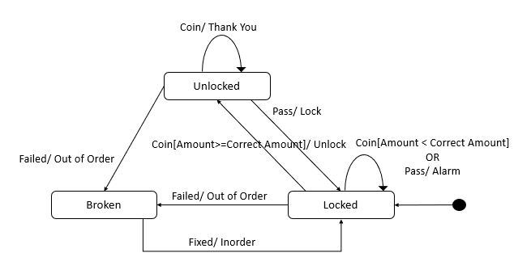

# turnstile-state-machine-python

Implementation of a state machine for a turnstile coin machine based on the diagram inspired from the following paper,
[Yacoub, S.M. and Ammar, H.H., 1998, August. A pattern language of statecharts. In Proc. Fifth Annual Conf. on the Pattern Languages of Program (PLoP’98) (pp. 98-29)](https://pdfs.semanticscholar.org/ef5c/03e76a6dcaddd85c692695cdc309fc637924.pdf)

<b>Figure:</b> Turnstile Coin Machine Specification

1. The states:
    - "Locked"
    - "Unlocked"
    - "Broken"
2. The events:
    - "Coin" for coin insertion
    - "Pass" for person passage
    - "Failed" for machine failure
    - "Fixed" for machine being fixed
3. The Actions - shows that the following actions are taken by the state machine in various states:
    - "Unlock" allows a person to pass
    - "Lock" prevents a person from passing
    - "Thankyou" displays a ThankYou message
    - "Alarm" shows an alarm message
    - "Outoforder" displays an out-of-order message
    - "Inorder" displays an In-order message

The coin machine should keep track of the amount of coins inserted. So, in the "Locked" state the machine keeps counting the amount inserted. Whenever the accumulated sum is greater than a predefined value (CorrectAmount), the person is allowed to pass, i.e. the transition to "UnLocked" state is activated, otherwise the machine will still maintain its "Locked" state.
On entering the "Locked" state the machine displays a message telling the user to insert coins to pass. Each time the machine leaves the locked state it should clear the amount of accumulated amount to zero.

## Running test

Run the test_turnstile.py file having the pre-defined test cases. You can add more test cases as necessary.
